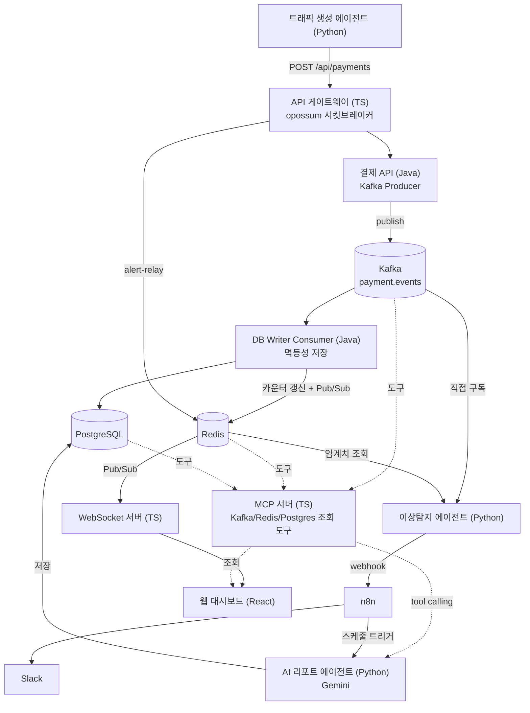

# payment-aiops-platform

가상의 결제 플랫폼에 실시간 트래픽을 흘려보내고, 이상 징후를 자동으로 탐지해 알리고, AI가 주기적으로
운영 리포트를 작성하고, 이 모든 흐름을 웹 대시보드에서 실시간으로 볼 수 있게 만든 폴리글랏
AIOps 플랫폼. Java/Python/TypeScript 세 언어를 각자의 강점에 맞는 자리에 배치했고, 개발 과정에서
실제로 겪은 문제들을 STAR 형식으로 전부 기록해뒀다.

**데모**: Terraform으로 EC2 + k3s에 올려서 `terraform apply` 한 번으로 아래 주소가 뜨는 것까지 확인함.

---

## 왜 이 프로젝트인가

Kafka로 결제 이벤트를 안정적으로 처리하는 백엔드/인프라에 집중했던 이전 프로젝트
([portfolio-payment-platform](../portfolio-payment-platform))의 위에, **자동화(n8n)와 AI 에이전트,
그리고 그걸 눈으로 보는 웹 대시보드**를 얹었다. 자세한 설계 이유는 [WORKFLOW.md](./WORKFLOW.md)와
[docs/ADR.md](./docs/ADR.md)에 전부 남겨뒀다 - "무엇을 만들었는가"가 아니라 "왜 그렇게 만들었는가"를
면접에서 바로 재구성할 수 있게 하는 것이 이 문서들의 목적이다.

## 아키텍처



## 기술 스택

| 영역 | 기술 | 왜 |
|---|---|---|
| 결제 API / DB Writer | Java 17, Spring Boot 4 | 강타입·트랜잭션 안정성이 필요한 핵심 로직 (ADR-1) |
| 트래픽생성 / 이상탐지 / AI 리포트 | Python | LLM·데이터 처리 생태계 (ADR-1, ADR-7) |
| API 게이트웨이 / WebSocket / MCP 서버 / 대시보드 | TypeScript (Node.js, React) | 비동기 I/O, 실시간 커넥션 (ADR-1, ADR-8, ADR-9) |
| 이벤트 로그 | Kafka | 내구성 있는 source of truth (ADR-2) |
| 실시간 상태 | Redis | 초단위 버킷 카운터 + Pub/Sub (ADR-2) |
| DB | PostgreSQL (컨테이너) | RDS 대신 직접 운영 (ADR-4) |
| 관측성 | Prometheus, Grafana, Tempo | 분산 트레이싱 + 메트릭 (ADR-5) |
| 자동화 | n8n | 알림 워크플로우, 스케줄 트리거 |
| 컨테이너/오케스트레이션 | Docker, k3s | 단일 노드 (ADR-3, ADR-10) |
| 인프라 프로비저닝 | Terraform | EC2 + IAM + k3s 자동 배포 (ADR-10) |

## 로컬에서 실행하기

```bash
docker-compose up -d          # Kafka/Redis/Postgres/Prometheus/Grafana/Tempo/nginx
cd n8n && docker-compose up -d

# 각 디렉터리에서
cd payment-api && ./mvnw.cmd spring-boot:run
cd db-writer-consumer && ./mvnw.cmd spring-boot:run
cd gateway && npm start
cd ws-server && npm start
cd mcp-server && npm start
cd dashboard && npm run dev

# Python 에이전트
cd agents/traffic-generator && python -u main.py --tps 5 --anomaly-probability 0.1
cd agents/anomaly-detector && python -u main.py
cd agents/report-agent && python -u main.py
```

**http://localhost/dashboard/** 접속. 운영 도구(Grafana/Prometheus/n8n)와 인프라 현황(EC2/Pod)도
사이드바에서 바로 접근 가능.

## 클라우드에 배포하기 (Terraform)

```bash
cd terraform
terraform init
terraform apply
```

EC2 생성부터 Docker/k3s 설치, GitHub 클론, 이미지 빌드, k8s 배포까지 전부 자동. 자세한 내용은
[terraform/README.md](./terraform/README.md) 참고.

## 문서

- [WORKFLOW.md](./WORKFLOW.md) — Phase별 계획과 진행 상황, "왜 이렇게 설계했는가"의 핵심 논리
- [docs/ADR.md](./docs/ADR.md) — 아키텍처 결정 기록 10건
- [docs/문제해결_로그.md](./docs/문제해결_로그.md) — 실제로 겪은 문제 7건을 STAR 형식으로 기록
- 대시보드의 "진행 상황" 메뉴 — Phase 진행 상태를 시각적으로 확인 가능
